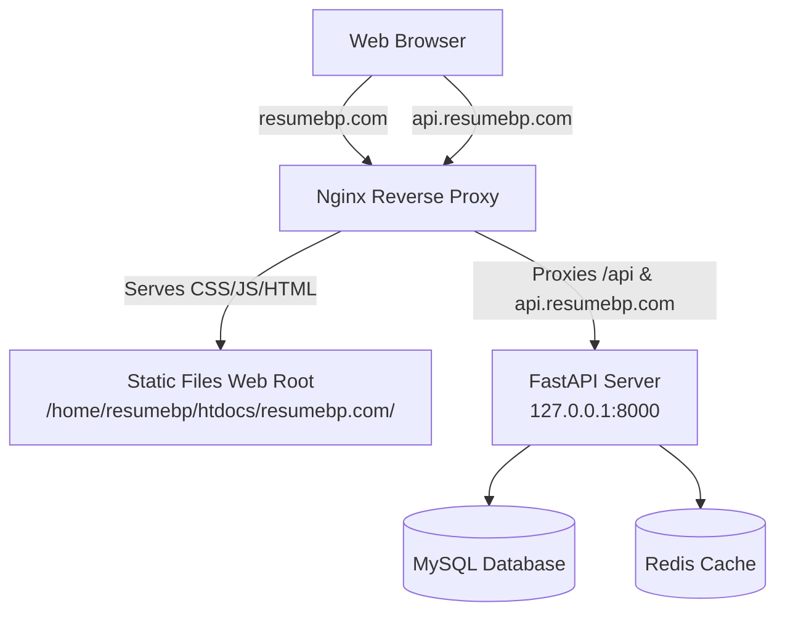

# Deployment Architecture & Setup Guide

This document outlines the production deployment architecture for **resumebp.com** and **api.resumebp.com** hosted on a CloudPanel-enabled server, including configuration details and automation instructions.

---

## 1. High-Level Architecture

The deployment splits the React client application and the FastAPI server application:

- **Frontend (resumebp.com)**: A React (Vite) application built into optimized static assets and served directly by Nginx.
- **Backend (api.resumebp.com)**: A FastAPI Python application running via the Gunicorn application server with Uvicorn workers, managed as a systemd service.
- **Database & Cache**: MySQL is used as the primary database, and Redis handles sessions and caching.
- **Reverse Proxy**: Nginx handles SSL termination, redirects HTTP/www traffic, serves static web root assets, and proxies API traffic.



---

## 2. Server Configuration Templates

Templates for the services are stored in the [deployment](file:///Users/suraj/Sites/R%20builder/deployment) directory:

- [fastapi.service](file:///Users/suraj/Sites/R%20builder/deployment/fastapi.service) - systemd unit definition.
- [nginx.conf](file:///Users/suraj/Sites/R%20builder/deployment/nginx.conf) - Nginx server blocks.

---

## 3. Step-by-Step Production Installation

### Step 3.1: Repository Setup
Clone the repository into the root folder:
```bash
git clone <your-repo-url> /root/r-builder
cd /root/r-builder
```

### Step 3.2: Database & Redis Setup
1. Create a MySQL database (e.g., `resumeai`) using CloudPanel or the mysql CLI.
2. Ensure Redis is installed and running on default port `6379`.
   ```bash
   sudo systemctl status redis-server
   ```

### Step 3.3: Backend Deployment Setup
1. Create a Python virtual environment:
   ```bash
   python3 -m venv /root/r-builder/backend/venv
   ```
2. Create and configure `/root/r-builder/backend/.env` using the template [backend/.env.example](file:///Users/suraj/Sites/R%20builder/backend/.env.example):
   ```bash
   cp backend/.env.example backend/.env
   nano backend/.env
   ```
   > [!IMPORTANT]
   > Make sure to update `DATABASE_URL` to point to your production MySQL instance, configure the production `SECRET_KEY`, and set appropriate provider API keys.
3. Install dependencies:
   ```bash
   /root/r-builder/backend/venv/bin/pip install -r backend/requirements.txt
   ```
4. Run initial database migrations:
   ```bash
   cd backend
   venv/bin/alembic upgrade head
   cd ..
   ```

### Step 3.4: Configure the systemd Service
1. Copy the systemd service template to the systemd directory:
   ```bash
   sudo cp deployment/fastapi.service /etc/systemd/system/fastapi.service
   ```
2. Reload systemd daemon, enable, and start the service:
   ```bash
   sudo systemctl daemon-reload
   sudo systemctl enable fastapi.service
   sudo systemctl start fastapi.service
   ```
3. Verify that the backend is running successfully:
   ```bash
   sudo systemctl status fastapi.service
   ```

### Step 3.5: Configure Nginx & SSL
1. Copy [nginx.conf](file:///Users/suraj/Sites/R%20builder/deployment/nginx.conf) to your Nginx sites-available:
   ```bash
   sudo cp deployment/nginx.conf /etc/nginx/sites-available/resumebp
   ```
2. Enable the site configuration:
   ```bash
   sudo ln -s /etc/nginx/sites-available/resumebp /etc/nginx/sites-enabled/
   ```
3. > [!NOTE]
   > Ensure that the certificate paths (`ssl_certificate` and `ssl_certificate_key`) in `/etc/nginx/sites-available/resumebp` match your Let's Encrypt certificates generated by CloudPanel.
4. Test configuration and restart Nginx:
   ```bash
   sudo nginx -t
   sudo systemctl restart nginx
   ```

---

## 4. Deployment Automation Script

The automated updates are handled by the [deploy_utils.sh](file:///Users/suraj/Sites/R%20builder/deploy_utils.sh) script located in the root of the project.

### Update Backend
Pulls latest changes, syncs dependencies, performs Alembic database migrations, and restarts the backend process:
```bash
./deploy_utils.sh update-backend
```

### Rebuild Frontend
Pulls latest changes, runs `npm install`, runs Vite compiler, and syncs static build assets to the Nginx root directory `/home/resumebp/htdocs/resumebp.com/` using `rsync` or copy commands:
```bash
./deploy_utils.sh rebuild-frontend
```

---

## 5. Log Files & Monitoring

Monitor operations and debug issues using the following logs:

| Component | Log Type | Path |
| :--- | :--- | :--- |
| **FastAPI Backend** | Access Logs | `/var/log/fastapi_access.log` |
| **FastAPI Backend** | Error Logs | `/var/log/fastapi_error.log` |
| **FastAPI Systemd** | Console Logs | `journalctl -u fastapi.service -f` |
| **Nginx Proxy** | resumebp.com Logs | `/home/resumebp/logs/nginx/resumebp.access.log` <br> `/home/resumebp/logs/nginx/resumebp.error.log` |
| **Nginx Proxy** | api.resumebp.com Logs | `/home/resumebp/logs/nginx/api.access.log` <br> `/home/resumebp/logs/nginx/api.error.log` |
