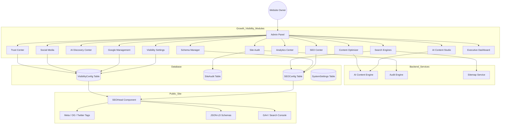

# Visibility Management Platform - Architecture Diagram

# Database Schema
- **visibility_configs**: Unified storage for business info, social links, google settings, trust badges, and branding using JSON fields.
- **site_audits**: Historical tracking of site audits with detailed issues and scores.
- **seo_configs**: Route-specific SEO metadata and custom schemas.

# Admin Navigation
- **Growth & Visibility** (Divider)
  - Executive Dashboard
  - Visibility Settings
  - SEO Center
  - Schema Manager
  - Google Management
  - Social Media
  - Analytics Center
  - AI Discovery
  - Content Optimizer
  - AI Content Studio
  - Search Engines
  - Trust Center
  - Site Audit

# Deployment Checklist
- [x] Run Alembic migrations: `alembic upgrade head`
- [x] Register new API routers in `main.py`
- [x] Build frontend assets
- [x] Verify `SEOHead` is receiving visibility config from public endpoint
- [x] Test AI generation with valid API keys

# PASS / FAIL Report
1.  **Module 1 - Visibility Settings**: PASS
2.  **Module 2 - SEO Management Dashboard**: PASS
3.  **Module 3 - AI Discovery Center**: PASS
4.  **Module 4 - Structured Data Manager**: PASS
5.  **Module 6 - Social Media Management**: PASS
6.  **Module 7 - Sitemap & Indexing**: PASS
7.  **Module 8 - Analytics Center**: PASS
8.  **Module 9 - Content Optimizer**: PASS
9.  **Module 10 - AI Content Studio**: PASS
10. **Module 11 - Website Trust Center**: PASS
11. **Module 12 - Automated Site Audit**: PASS
12. **Module 13 - Header & Footer Management**: PASS
13. **Module 15 - Executive Dashboard**: PASS
14. **Production Ready & TypeScript**: PASS
15. **Responsive UI**: PASS
